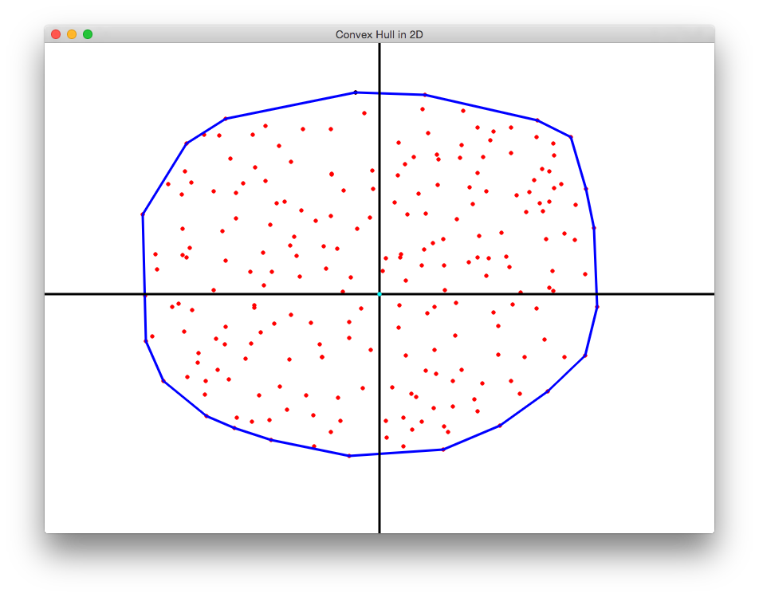

# Draw

This is a small program for visualizing the result of the Graham Scan.

## How to Use

* Use mouse to add points on the screen. The hull is computed everytime a point is added.
* Press 'H' to draw the hull.
* Press 'C' to clear the points.

